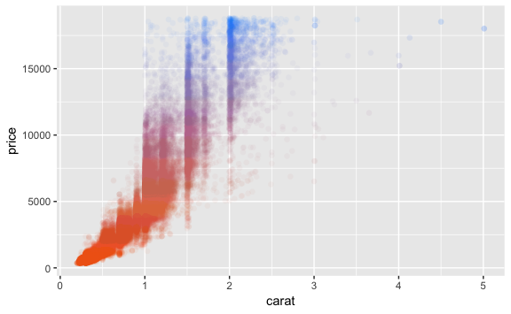

# goodgraphic

**Private** tools for ggplot2

This package is a set of functions that are frequently used by
[ygeunkim](https://github.com/ygeunkim) with `ggplot2`.

## Install

``` r
devtools::install_github("ygeunkim/goodgraphic")
```

Using `tidyverse` package is recommended.

``` r
library(tidyverse)
library(goodgraphic)
```

## Scatter plot

This is the function motivated by Jackson
(2017).

``` r
gg_scatter(diamonds, mapping = aes(x = carat, y = price), alpha_focus = TRUE, size = 2)
```



-----

## Reference

<div id="refs" class="references">

<div id="ref-scatter">

Jackson, Simon. 2017. “Pretty Scatter Plots with Ggplot2.”
<https://www.r-bloggers.com/pretty-scatter-plots-with-ggplot2/>.

</div>

</div>
